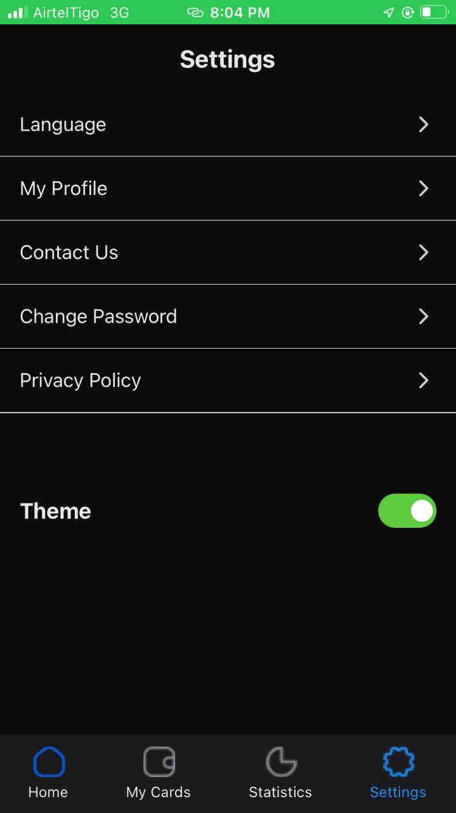

# -rn-assignment5-11283519

I started building my React Native app by initializing the project with Expo, which simplifies the development workflow. I used the command npx expo init myrnapp and selected a suitable template. After initializing, I installed necessary dependencies such as react, react-native, styled-components, and React Navigation libraries by adding them to the package.json file and running npm install.

Next, I set up the basic structure of the app. The main file, App.js, served as the entry point where I configured navigation and initial settings. For styling, I used styled-components to write CSS-in-JS, allowing for a modular and reusable approach. I created styled components to ensure a consistent look and feel throughout the app.

To handle navigation, I implemented React Navigation libraries like @react-navigation/native and @react-navigation/bottom-tabs. This allowed me to create stack and bottom tab navigators for managing navigation between different screens. I developed several screens, such as Home, Profile, and Settings, each with its own layout and functionality.

For state management, I used React's useState and useEffect hooks to efficiently manage the app's state. Although I relied on these built-in tools, I could have used libraries like Redux for more complex state management needs. Throughout development, I used Expo's development tools to run and test the app on various platforms, launching the development server with npx expo start.

When the app was ready, I prepared it for production by running expo build commands, which generated the necessary binaries for iOS and Android. Finally, I published the app to the respective app stores using Expo's publish tools or by manually submitting the build files. This process outlines the steps I followed to build my React Native app using Expo.

   
